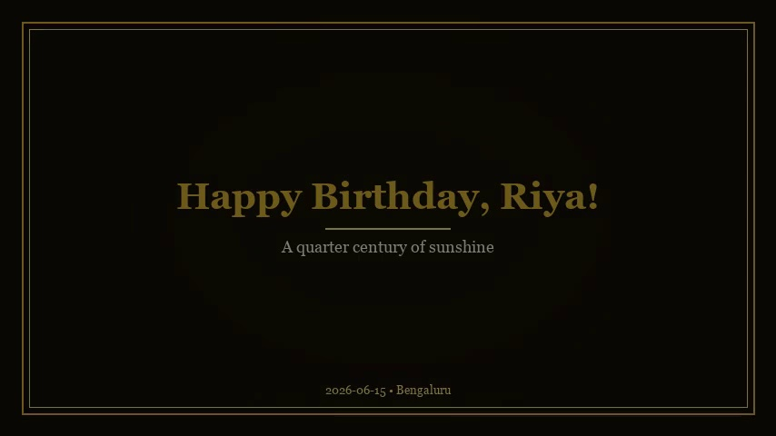
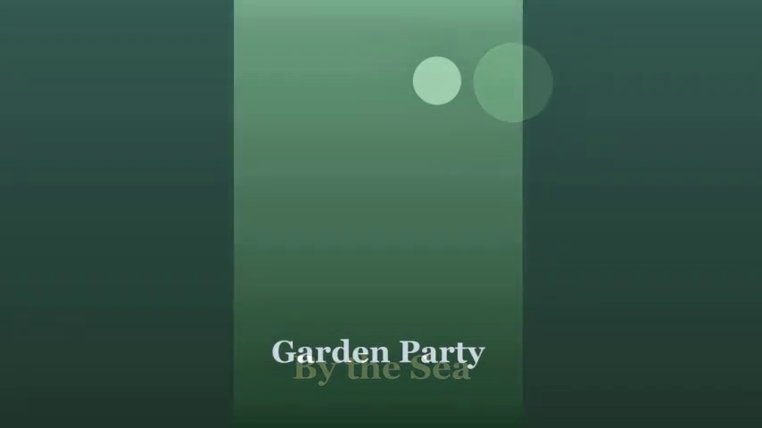
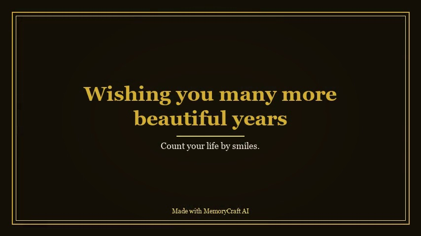

<div align="center">

# 🎞️ MemoryCraft AI

### Turn ordinary photos into cinematic stories — automatically.

*Your photographer, video editor, designer and album maker — all in one Python app.*

[](https://www.python.org/)
[](https://streamlit.io/)
[](https://zulko.github.io/moviepy/)
[](https://opencv.org/)
[](LICENSE)
[](../../pulls)

**Upload photos → pick an occasion → click Generate. That's it.**



*Every frame above was generated automatically — title, typography, colors and motion all come from the theme engine.*

</div>

---

## ✨ What it creates from one click

| | Deliverable | What you get |
|---|---|---|
| 🎬 | **Cinematic film** | Full-HD slideshow with Ken Burns pan & zoom, crossfades, themed opening/closing scenes, lower-third captions and music synchronized to the exact runtime |
| 📖 | **PDF memory book** | Print-ready album: cover, event info, timeline, photo pages with captions, family wishes and a thank-you page |
| 🖼️ | **Photo collage** | Themed mosaic poster, perfect as a social-media cover |
| 🗓️ | **Interactive timeline** | Plotly timeline of your dated memories, exportable as shareable HTML |
| 🔗 | **QR share card** | A themed poster guests scan at the party to open your video instantly |

<div align="center">
&nbsp;

<br><em>Left: portrait photo framed with cinematic blurred-fill, mid-crossfade &nbsp;·&nbsp; Right: closing scene with your quote</em>
</div>

## 🧠 The intelligence — zero manual editing

- 📅 **Chronological storytelling** — photos sorted by EXIF capture date automatically
- 🧹 **Duplicate removal** — near-identical shots detected via color-aware perceptual hashing
- 🖼️ **Smart framing** — portraits & panoramas get the cinematic blurred-fill treatment, never distorted or cropped badly
- ✨ **Gentle auto-enhancement** — CLAHE contrast recovery, saturation lift, unsharp mask (never looks "filtered")
- 🎵 **Music sync** — soundtrack looped/trimmed to the film's exact length with fade-in/out
- 🛡️ **Fail-soft pipeline** — one corrupt file logs a warning and is skipped; it never kills a 300-photo render

## 🎉 15 occasions · 🎨 10 themes

**Occasions:** Birthday · Wedding · Anniversary · Silver & Golden Jubilee · Graduation · Baby Shower · House Warming · Family Reunion · Travel · Festivals · Retirement · Farewell · Memorial Tribute · Custom

**Themes:** Elegant Gold · Royal · Classic · Minimal · Floral · Vintage · Luxury · Modern · Kids · Traditional

Each occasion carries its own copy, pacing and music mood; each theme drives fonts, colors, transitions and motion — and **one theme styles every deliverable**, so your film, book, collage and QR card always match.

## 🚀 Quick start

Requires **Python 3.10+**. FFmpeg is bundled via `imageio-ffmpeg` — nothing extra to install.

```bash
git clone https://github.com/<you>/MemoryCraft_AI.git
cd MemoryCraft_AI
python -m venv .venv
.venv\Scripts\activate              # Windows  (source .venv/bin/activate on macOS/Linux)
pip install -r requirements.txt

python scripts/make_samples.py      # optional: demo photos with EXIF dates
streamlit run app.py
```

Open http://localhost:8501 and follow the five-step wizard:

> **1 · Occasion → 2 · Memories → 3 · Words → 4 · Style → 5 · Generate** 🎬

💡 *Tip: render a **Draft preview (480p)** first — it's fast — then switch to **Full quality (1080p)** for the final export.*

## 🏗️ Architecture

Clean layering: the UI never touches SQL or MoviePy — it talks to a service layer that orchestrates a framework-free domain.

```
app.py                     ← Streamlit entry (thin shell)
memorycraft/
├── config.py              ← paths, render settings, font map
├── services.py            ← application layer (UI ↔ domain)
├── core/                  ← framework-free domain
│   ├── events.py          ← 15 event profiles (copy, pacing, music mood)
│   ├── themes.py          ← 10 themes (color, type, motion, framing)
│   ├── models.py          ← Project / MediaItem / Output dataclasses
│   └── database.py        ← SQLite repository
├── processing/            ← multimedia engine
│   ├── image_processor.py ← EXIF, dedupe, enhance, smart framing
│   ├── title_cards.py     ← Pillow-rendered cards & lower thirds
│   ├── video_generator.py ← MoviePy 2.x cinematic renderer
│   ├── pdf_builder.py     ← ReportLab memory book
│   ├── collage.py · timeline.py · qr_share.py
└── ui/                    ← Streamlit pages (presentation only)
```

Adding a new occasion or theme is a **one-entry change** in a registry — no other code touched.

## ⚙️ Tuning

Everything cinematic is configurable in [`memorycraft/config.py`](memorycraft/config.py):

| Setting | Default | Meaning |
|---|---|---|
| `VIDEO_SIZE` / `VIDEO_FPS` | 1920×1080 / 30 | final render quality |
| `PHOTO_DURATION` | 4.0 s | seconds per slide (scaled by event pacing) |
| `CROSSFADE` | 0.9 s | transition overlap |
| `KEN_BURNS_ZOOM` | 1.12 | max pan & zoom factor |

## 🧰 Tech stack — 100% free & open-source

`Python` · `Streamlit` · `MoviePy 2` · `OpenCV` · `Pillow` · `NumPy` · `Plotly` · `ReportLab` · `qrcode` · `SQLite`

## 📄 License

MIT — use it, fork it, celebrate with it. ⭐ **If MemoryCraft made your celebration easier, a star means a lot!**

